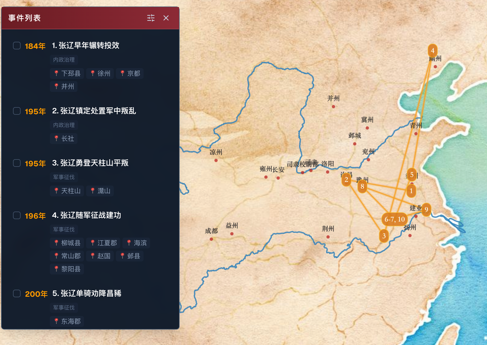
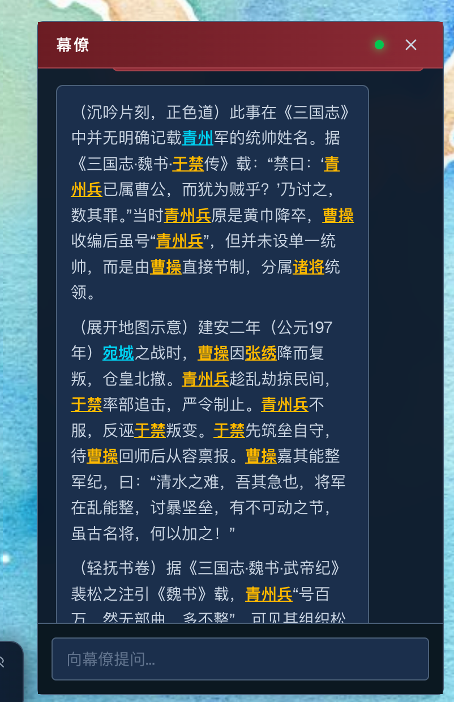

# 三国志数字沙盘与智能体系统

本项目是一个结合图数据库（Neo4j）、关系数据库（MySQL）与大语言模型（DeepSeek）的《三国志》数字地图沙盘与史料检索分析系统。支持动态时间轴事件渲染、多维人物/事件过滤、地理点高亮以及深度正史智能对话。

## 核心功能

### 1. 时间卷轴（时间轴）功能

* **时空演进展示**：拖动底部的历史时间卷轴，可动态筛选并在地图上渲染同一历史年份发生的所有《三国志》事件。
* **地理分布投影**：事件发生的地点（州、郡、县）会在 3D 数字沙盘上通过高亮光圈与标记投影出来，帮助用户直观感受楚汉群雄逐鹿、三国势力版图的动态迁移。

### 2. 多维事件列表与地图联动

* **时间范围检索**：自定义时间滑块，支持跨度查询（如公元 190 年 - 195 年）。
* **多人物/地点/类型过滤**：
  * **人物包含/排除**：输入特定武将（如“徐晃, 张辽”），快速检索他们共同参与的战役或事件，或排除特定人物干扰。
  * **地缘辐射**：点击地图上的任何一个省/郡/县节点，系统会自动展开并高亮其子辖区，检索该地点及其所有下属区域在历史时间段内发生的所有事件。
* **双向联动**：点击列表中的事件，地图会自动平滑平移（FlyTo）并缩放到对应的地理位置；点击地图标记，右侧侧边栏会展开并聚焦该事件详情。

### 3. 三国正史智能体（Agent）

* **意图拆解与指代消解**：内置大模型前置问题拆解引擎。自动区分“闲聊或元问题”（如“我刚才问了啥”）、“特定历史事实”（如“徐晃最开始跟谁”）、“人物关系纠葛”（如“刘备与臧霸的关系”），并结合上下文历史自动补充或替换代词，防止由于语义缺失生成错误的图查询。
* **Neo4j 宽口径多维召回**：对于复杂关系问题，自动转化为 Cypher 语句，并使用模式列表推导式（Pattern Comprehension）将两人直接事件、共同关联人、共同地点、人物各自轨迹等一并召回，规避笛卡尔积。
* **正史来源与原文引述（严禁演义）**：所有历史问题解答均**必须注明《三国志》正史出处**（如《三国志·蜀书·先主传》、裴松之注等），并**完整引述数据库中对应的正史古籍原文（`source_text`）**。
* **上下文对话记忆**：支持滑动窗口上下文记忆，精准记住最近 10 段对话（共 20 条消息），在保持轻量化运行的同时支持连贯的多轮深度历史对话。
* **极速输入体验**：重构了输入框状态流，将打字输入框状态限制在幕僚面板内部，避开了顶层重型地图组件的重渲染，打字输入零卡顿。

---

## 快速开始

### 1. 后端启动 (FastAPI + Neo4j)

确保已安装依赖包：
```bash
pip3 install -r requirements.txt
```

配置 `.env` 文件中的数据库与 API Key：
```env
DEEPSEEK_API_KEY="your-deepseek-api-key"
MYSQL_HOST="localhost"
MYSQL_USER="root"
MYSQL_PASSWORD="your-mysql-password"
MYSQL_DB="sanguo"
# 以及 Neo4j 的连接配置等
```

启动 API 服务：
```bash
python3 server.py
```
服务默认运行在 `http://127.0.0.1:8000`。

### 2. 前端启动 (Next.js)

进入前端目录：
```bash
cd frontend
npm install
npm run dev
```
打开浏览器访问 `http://localhost:3000` 即可开启数字沙盘。

---

## 数据清洗重建与数据备份工作流

为了防止线上数据修正不同步，项目提供了自动化回写脚本：

### 每日定时将 Neo4j 数据回写同步至本地 JSON (推荐，自动同步)
使用 [scripts/backup_neo4j_to_json.py](file:///Users/kansen/Documents/Code/Sanguozhi/scripts/backup_neo4j_to_json.py) 脚本。该脚本会查询当前 Neo4j 全库的最新数据状态，并根据 `seq_index` 自动回写更新本地 `data/raw/*.json` 对应条目的字段。

#### 1. 手动运行备份回写：
```bash
python3 scripts/backup_neo4j_to_json.py
```

#### 2. 配置 Cron 定时任务：
通过系统的 `crontab -e` 配置每日夜里 2:00 定时执行备份回写（自动更新本地 JSON 且不污染 Git）：
```cron
0 2 * * * /usr/bin/python3 /Users/kansen/Documents/Code/Sanguozhi/scripts/backup_neo4j_to_json.py >> /Users/kansen/Documents/Code/Sanguozhi/scripts/backup.log 2>&1
```

*注：由于数据文件已添加至 `.gitignore`，你可以随时在本地拉取这些最新被回写的 JSON，重新运行 `build_graph_pipeline.py` 即可原样回灌。*
